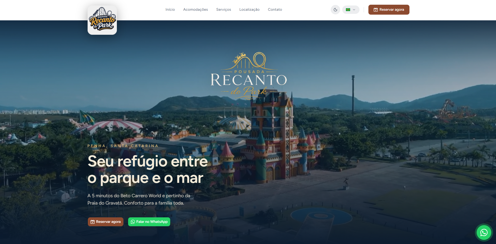

<h1 align="center"> Recanto do Park 🎢</h1>

Site institucional da Pousada Recanto do Park, em Penha/SC, a poucos minutos do Beto Carrero World e das praias da região.

  <a href="#-tecnologias">Tecnologias</a>&nbsp;&nbsp;&nbsp;|&nbsp;&nbsp;&nbsp;
  <a href="#-projeto">Projeto</a>

  
 

## 🚀 Tecnologias

Esse projeto foi desenvolvido com as seguintes tecnologias:

- Next.js (App Router)
- React
- TypeScript
- Tailwind CSS
- GSAP
- next-intl
- Playwright
- Git e Github

## 💻 Projeto

- Site multilíngue (pt/en/es) da pousada, com páginas de acomodações geradas estaticamente (SSG), animações de scroll com GSAP e modo claro/escuro.

- Interface pensada para conversão via WhatsApp, com seções de localização, comodidades, galeria e depoimentos destacando a proximidade com o Beto Carrero World e as praias de Penha.

<h2 align="center">📌 Desenvolvedores</h2>

<table align="center">
  <tr>
    <td align="center">
      <a href="https://github.com/rebellatoGui" title="GitHub">
         
        
          <b>Guilherme Rebellato</b>
        
      </a>
    </td>
  </tr>
</table>

 

---

Feito com ♥ por rebellatoGui

